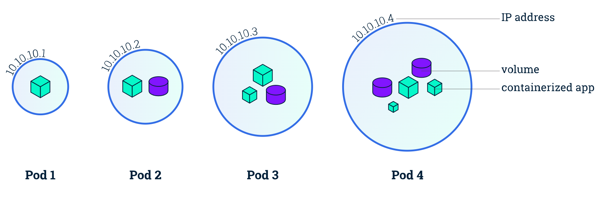

**Table of Contents**- [What is kubernetes api-resources](#what-is-kubernetes-api-resources)
- [What is kubernetes api-resources](#what-is-kubernetes-api-resources)
- [What is Pod](#what-is-pod)
- [Key Points about Pods](#key-points-about-pods)
- [Run simple Pod](#run-simple-pod)
- [What is ReplicaSets](#what-is-replicasets)
  - [Key Features:](#key-features)
- [ReplicaSets Lab](#replicasets-lab)
- [What is a Kubernetes Service?](#what-is-a-kubernetes-service)
- [Why use a Kubernetes Service?](#why-use-a-kubernetes-service)
- [Types of Kubernetes Services](#types-of-kubernetes-services)
- [Authenticate for private registry](#authenticate-for-private-registry)


## What is kubernetes api-resources
The kubectl api-resources command provides a concise overview of the available Kubernetes API resources. Here's a breakdown of the columns displayed:

`kubectl api-resources -o wide`

**NAME:** This column lists the names of the API resources. Each resource represents a particular object type that can be managed within Kubernetes.

**SHORTNAMES:** Some resources have abbreviated shortnames for convenience. These shortnames can be used as shortcuts when running commands.

**APIGROUP:** API groups are a way to group related resources together under a common namespace. This column indicates the API group to which each resource belongs. If the resource doesn't belong to any specific group, it will be blank.

**NAMESPACED:** This column indicates whether the resource is namespaced. Namespaced resources are scoped to a specific namespace within the Kubernetes cluster. If a resource is namespaced, it means you can create multiple instances of that resource in different namespaces.

**KIND:** The "Kind" column indicates the type of object the resource represents. For example, Deployment, Pod, Service, etc.

**VERBS:** This column lists the verbs that can be used with each resource. Verbs represent the actions that can be performed on the resource, such as create, delete, get, list, patch, update, and watch.

## What is Pod
In Kubernetes, a Pod is the smallest and simplest unit of deployment. It represents a single instance of a running process in your cluster. A Pod can contain one or more containers, which are tightly coupled and share resources such as networking and storage.

## Key Points about Pods

- **Atomic Unit**: A Pod encapsulates one or more application containers, storage resources, a unique network IP, and configuration options. It's the basic building block of Kubernetes applications.
- **Containers**: Pods can contain one or more containers, which are managed as a single entity within the Pod. These containers share the same network namespace, allowing them to communicate with each other using localhost.
- **Networking**: Each Pod in Kubernetes is assigned a unique IP address, which allows communication between Pods and external clients or other Pods within the same cluster.
- **Storage**: Pods can define volumes that are mounted into their containers, allowing them to share data between containers or persist data beyond the lifetime of the Pod.
- **Lifecycle**: Pods have a lifecycle managed by the Kubernetes control plane. They can be created, updated, and terminated based on deployment configurations, scaling requirements, or failures.
- **Atomicity and Scalability**: Pods are atomic units that can be replicated and scaled horizontally. You can create multiple replicas of a Pod to handle increased load or ensure high availability.

<p align="center">
  
  <br/>
  Pic: Pod
</p>


## Run simple Pod
Here's an example of using imperative (command-line) approaches to run a Pod.

Create an NGINX Pod\
`kubectl run nginx --image=nginx`

Dry run. Print the corresponding API objects without creating them.\  
`kubectl run nginx --image=nginx --dry-run=client`

Generate POD Manifest YAML file (-o yaml) with (–dry-run)\
`kubectl run nginx --image=nginx --dry-run=client -o yaml`

Run with Labels, Example tier\
`kubectl run redis -l tier=db --image=redis:alpine`

Deploy a `redis` pod using the `redis:alpine` image with the labels set to `tier=db`.\
`kubectl run redis --image=redis:alpine --labels tier=db`

List all pods in all namespaces, with more details\
`kubectl get pods -o wide --all-namespaces`

List the nodes\
`kubectl get nodes`

Use "kubectl describe" for related events and troubleshooting\
`kubectl describe pods <podid>`

Add "-o wide" in order to use wide output, which gives you more details.\
`kubectl get pods -o wide`

Check always all namespaces by including "--all-namespaces"\
`kubectl get pods --all-namespaces`

Start a busybox pod and keep it in the foreground, don't restart it if it exits.\
`kubectl run -i -t busybox --image=busybox --restart=Never`

## What is ReplicaSets
A ReplicaSet is a Kubernetes controller that ensures a specified number of pod replicas are running at any given time. It's part of Kubernetes' core workload resources and is designed to maintain a stable set of replica pods, typically for stateless services.

### Key Features:
1. **Desired State**: ReplicaSets define a desired state, specifying the number of replicas that should be running.

2. **Selectors**: ReplicaSets use labels and selectors to identify the pods they are responsible for managing. Pods managed by a ReplicaSet have a label that matches the ReplicaSet's selector.

3. **Scalability**: You can scale the number of replicas up or down dynamically by updating the ReplicaSet's configuration.

4. **Self-Healing**: If a pod managed by a ReplicaSet fails or is deleted, the ReplicaSet controller automatically creates a new pod to maintain the desired number of replicas.

5. **Immutable Updates**: ReplicaSets manage pod templates, so when you want to update a ReplicaSet, you typically create a new ReplicaSet with the desired changes rather than modifying the existing one directly.

ReplicaSets are often used in conjunction with Deployments, which provide additional features such as rolling updates and rollbacks. Deployments manage ReplicaSets to ensure that changes to your application's configuration are rolled out smoothly and with minimal disruption.

## ReplicaSets Lab
How many replication controler exist on the system\
`kubectl get rc`

How about now? How many ReplicaSets do you see?\
`kubectl get replicasets`

creates a ReplicaSet named nginx-replicaset with three replicas, using the NGINX image (nginx) and exposing port 80.\
`kubectl create replicaset nginx-replicaset --replicas=3 --image=nginx --port=80`

How many PODs are DESIRED in the `nginx-replicaset`?\
`kubectl get rs`

What is the image used to create the pods in the `nginx-replicaset`?\
`kubectl describe rs nginx-replicaset`

Scale the ReplicaSet to 5 PODs.\
`kubectl edit replicaset nginx-replicaset`

`kubectl scale rs nginx-replicaset --replicas=5`

Now scale the ReplicaSet down to 2 PODs.\
`kubectl scale rs nginx-replicaset --replicas=2`


## What is a Kubernetes Service?
The idea of a Service is to group a set of Pod endpoints into a single resource. You can configure various ways to access the grouping. By default, you get a stable cluster IP address that clients inside the cluster can use to contact Pods in the Service. A client sends a request to the stable IP address, and the request is routed to one of the Pods in the Service.

A Service identifies its member Pods with a selector. For a Pod to be a member of the Service, the Pod must have all of the labels specified in the selector. A label is an arbitrary key/value pair that is attached to an objec


## Why use a Kubernetes Service?
In a Kubernetes cluster, each Pod has an internal IP address. But the Pods in a Deployment come and go, and their IP addresses change. So it doesn't make sense to use Pod IP addresses directly. With a Service, you get a stable IP address that lasts for the life of the Service, even as the IP addresses of the member Pods change.

A Service also provides load balancing. Clients call a single, stable IP address, and their requests are balanced across the Pods that are members of the Service.


## Types of Kubernetes Services
There are five types of Services:

ClusterIP (default): Internal clients send requests to a stable internal IP address.

NodePort: Clients send requests to the IP address of a node on one or more nodePort values that are specified by the Service.

LoadBalancer: Clients send requests to the IP address of a network load balancer.

ExternalName: Internal clients use the DNS name of a Service as an alias for an external DNS name.

Headless: You can use a headless service when you want a Pod grouping, but don't need a stable IP address.

Here Example of Service:
```yaml
apiVersion: v1
kind: Service
metadata:
  name: nginx-service
spec:
  selector:
    app: nginx-pod
  ports:
    - protocol: TCP
      port: 80
      targetPort: 80
  type: LoadBalancer
```

## Authenticate for private registry

Create a secret object with the credentials required to access the registry.
```
Name: private-reg-cred
Username: dock_user
Password: dock_password
Server: myprivateregistry.com:5000
Email: dock_user@myprivateregistry.com
```
```
kubectl create secret docker-registry private-reg-cred \
  --docker-server=myprivateregistry.com:5000 \
  --docker-username=dock_user \
  --docker-password=dock_password \
  --docker-email=dock_user@myprivateregistry.com
```

[References](https://kubernetes.io/docs/concepts/containers/images/#using-a-private-registry)