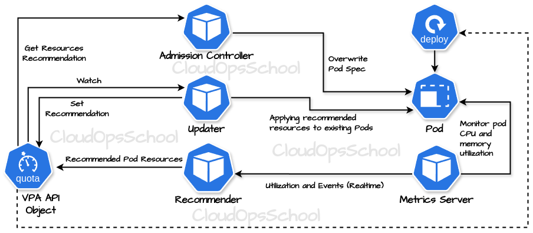

 <h2> Kubernetes  Autoscalin Configuration </h2>
  Scalability is one of the core benefits of Kubernetes (K8s). In order to get the most out of this benefit (and use K8s effectively), you need a solid understanding of how Kubernetes autoscaling works.

**Table of Contents**
- [What is kubernetes autoscaler](#what-is-kubernetes-autoscaler)
- [Autoscaling dimensions Kubernetes](#autoscaling-dimensions-kubernetes)
- [Horizontal Pod Autoscaling (HPA) Configuration Steps](#horizontal-pod-autoscaling-hpa-configuration-steps)
  - [Steps 1: Create a k8s cluster.](#steps-1-create-a-k8s-cluster)
  - [Steps 2: Install the Metrics Server.](#steps-2-install-the-metrics-server)
  - [Steps 3: Deploy a sample application](#steps-3-deploy-a-sample-application)
  - [Steps 4: Apply Horizontal Pod Autoscaler.](#steps-4-apply-horizontal-pod-autoscaler)
  - [Increase load to the Application.](#increase-load-to-the-application)
  - [Monitor Events](#monitor-events)
- [Vertical Pod Autoscaling (VPA)](#vertical-pod-autoscaling-vpa)
  - [Kubernetes VPA resource configuration types](#kubernetes-vpa-resource-configuration-types)
- [Vertical Pod Autoscaler (VPA) Configuration Steps](#vertical-pod-autoscaler-vpa-configuration-steps)

 ## What is kubernetes autoscaler
 Autoscaling in Kubernetes refers to the automatic adjustment of resources in response to changes in workload demand. Kubernetes provides several mechanisms for autoscaling: 
- Including Horizontal Pod Autoscaling (HPA)
- Vertical Pod Autoscaler (VPA)
- Cluster Autoscaler

## Autoscaling dimensions Kubernetes
**Including Horizontal Pod Autoscaling (HPA):** Horizontal Pod Autoscaling (HPA) adjusts the number of replicas of a Kubernetes Deployment, ReplicaSet, or StatefulSet based on observed CPU or memory utilization. It ensures that your application has enough resources to handle increased traffic or usage and can automatically scale down when demand decreases, optimizing resource utilization and minimizing costs.

<p align="center">
  
  <br/>
  Pic: Horizontal Pod Autoscaling (HPA)
</p>

**Vertical Pod Autoscaler (VPA):** Vertical Pod Autoscaler (VPA) adjusts the resource requests and limits of individual containers within Pods based on historical resource usage. It optimizes resource allocation within Pods, ensuring that each container has adequate resources to operate efficiently without over-provisioning.

**Cluster Autoscaler:** Cluster Autoscaler, on the other hand, adjusts the number of nodes in a Kubernetes cluster based on resource utilization and pending Pods. It ensures that your cluster has enough capacity to run your workloads efficiently and can automatically scale up by provisioning new nodes or scale down by removing underutilized nodes.

**The different autoscalers work at one of two Kubernetes layers**

- Pod level: The HPA and VPA methods take place at the pod level. Both HPA and VPA will scale the available resources or instances of the container.
- Cluster level: The Cluster Autoscaler falls under the Cluster level, where it scales up or down the number of nodes inside your cluster.

## Horizontal Pod Autoscaling (HPA) Configuration Steps
We’ll work through the following steps one-by-one
1. Create a k8s cluster
2. Install the Metrics Server
3. Deploy a sample application
4. Apply Horizontal Pod Autoscaler
5. Increase load to the Application
6. Monitor Events

### Steps 1: Create a k8s cluster.
If you don't already have a Kubernetes cluster, please follow the instructions provided in the [References](https://github.com/nasirnjs/kubernetes/tree/main/k8s-cluster-setup) to set up one efficiently.

### Steps 2: Install the Metrics Server.
Metrics Server can be installed either directly from YAML manifest or via the official [Helm chart](https://artifacthub.io/packages/helm/metrics-server/metrics-server). To install the latest Metrics Server release from the components.yaml manifest, run the following command. [References](https://github.com/kubernetes-sigs/metrics-server?tab=readme-ov-file#readme)

`kubectl apply -f https://github.com/kubernetes-sigs/metrics-server/releases/latest/download/components.yaml`

**If Metrics Server does not work perfectly follow this [References](https://github.com/nasirnjs/kubernetes/blob/main/k8s-metrics-server/install-metrics-server.md)**

First, get the name of the Metric Server pod.\
`kubectl get pods -n kube-system | grep metrics-server`

If you want to see the top pods based on CPU.\
`kubectl top pods --sort-by cpu -A`

And to see the top pods based on memory usage.\
`kubectl top pods --sort-by memory`

### Steps 3: Deploy a sample application
Now create a Nginx deployment with Horizontal Pod Autoscaler (HPA) based on CPU usage

To check if your cluster supports autoscaling API version.\
`kubectl api-versions | grep autoscaling`

Create nginx deployment
```bash
apiVersion: apps/v1
kind: Deployment
metadata:
  name: nginx-deployment
spec:
  replicas: 2
  selector:
    matchLabels:
      app: nginx
  template:
    metadata:
      labels:
        app: nginx
    spec:
      containers:
      - name: nginx
        image: nginx
        resources:
          limits:
            cpu: "200m" # Set CPU resource limit
          requests:
            cpu: "100m" # Set CPU resource request
```
Create the Kubernetes service, Create Service for our nginx-deployment
```bash
apiVersion: v1
kind: Service
metadata:
  name: nginx-service
spec:
  selector:
    app: nginx
  ports:
    - protocol: TCP
      port: 80
      targetPort: 80
  type: LoadBalancer
```

### Steps 4: Apply Horizontal Pod Autoscaler.
To scale our resources, we will use HPA to scale up when traffic increases and scale down the resources when traffic decreases. Create Horizontal Pod Autoscaler (HPA)

```bash
apiVersion: autoscaling/v1
kind: HorizontalPodAutoscaler
metadata:
  name: nginx-hpa
spec:
  scaleTargetRef:
    apiVersion: apps/v1
    kind: Deployment
    name: nginx-deployment
  minReplicas: 2
  maxReplicas: 10
  targetCPUUtilizationPercentage: 30
```
You can configuration imperative way.\
`kubectl autoscale deployment nginx-deployment --cpu-percent=30 --min=2 --max=10`

Verify the HPA deployment.\
`kubectl get hpa -w`

### Increase load to the Application.
So far, we have set up our EKS cluster, installed the Metrics Server, deployed a sample application, and created an associated Kubernetes service for the application. We also deployed HPA, which will monitor and adjust our resources.

`ab [options] [http[s]://]hostname[:port]/path`\
`ab -n 10000000 -c 1000 http://172.17.18.211:80`

Options:

- `-n requests`: Total number of requests to perform during the test.
- `-c concurrency`: Number of multiple requests to perform at a time.
- `-t timelimit`: Maximum number of seconds to spend on benchmarking.
- `-k`: Use HTTP KeepAlive feature, i.e., perform multiple requests within one HTTP session.
- `-p POSTfile`: File containing data to POST.
- `-T content-type`: Content-type header for POSTing data.
- `-H headerline`: Additional header to send, e.g., `'Accept-Encoding: gzip'`.
- `-v verbosity`: Set verbosity level, where 0 is the least verbose and 4 is the most verbose.

### Monitor Events
`kubectl get hpa`

`watch kubectl get pod`

`kubectl get events`


**Note:** The HPA controller continuously monitors the metrics and adjusts the number of replicas based on the defined criteria. In this case, since the CPU utilization has dropped to 0%, the HPA will wait for some time (usually around 5 minutes) to ensure that the decreased load is sustained before scaling down the replicas. This delay helps prevent frequent scaling events caused by temporary fluctuations in the workload.


## Vertical Pod Autoscaling (VPA)
The Vertical Pod Autoscaler (VPA) is a component in Kubernetes designed to automatically adjust the CPU and memory resource requests of pods to match their actual resource usage. Unlike the Horizontal Pod Autoscaler (HPA), which scales the number of pod replicas based on CPU or memory utilization, the VPA focuses on adjusting the resource requests of individual pods to optimize resource utilization within the cluster.

Autoscaling is configured with a Custom Resource Definition object called [VerticalPodAutoscaler](https://github.com/kubernetes/autoscaler). It allows to specify which pods should be vertically autoscale as well as if/how the resource recommendations are applied. [Infra References](https://github.com/kubernetes/design-proposals-archive/blob/main/autoscaling/vertical-pod-autoscaler.md)


<p align="center">
  
  <br/>
  Pic: VPA Architecture overview
</p>


### Kubernetes VPA resource configuration types
With the Vertical Pod Autoscaler (VPA) in Kubernetes, you can manage two different types of resource configurations for each container within a pod. 

1. Requests
Requests define the minimum number of resources that containers need. For example, an application can use more than 256MB of memory, but Kubernetes will guarantee a minimum of 256MB to the container if its request is 256MB of memory.

2. Limits
Limits define the maximum number of resources that a given container can consume. Your application might require at least 256MB of memory, but you might want to ensure that it doesn’t consume more than 512MB of memory, i.e., to limit its memory consumption to 512MB.


Apply the recommendations directly by updating/recreating the pods (updateMode = auto).
Store the recommended values for reference (updateMode = off).
Apply the recommended values to newly created pods only (updateMode = initial).


## Vertical Pod Autoscaler (VPA) Configuration Steps
Steps 1: Installation of Metrics Server


Steps 2: Installation of Vertical Pod Autoscaler

`git clone https://github.com/kubernetes/autoscaler.git`
`cd autoscaler/vertical-pod-autoscaler`

`./hack/vpa-up.sh`

`kubectl top pods`

`kubectl describe vpa hamster-vpa`

`kubectl apply -f vpa-off-deployment.yaml`

`kubectl apply -f vpa-auto-deployment.yaml`


https://www.kubecost.com/kubernetes-autoscaling/kubernetes-vpa/
https://foxutech.medium.com/vertical-pod-autoscaler-vpa-know-everything-about-it-6a2d7a383268