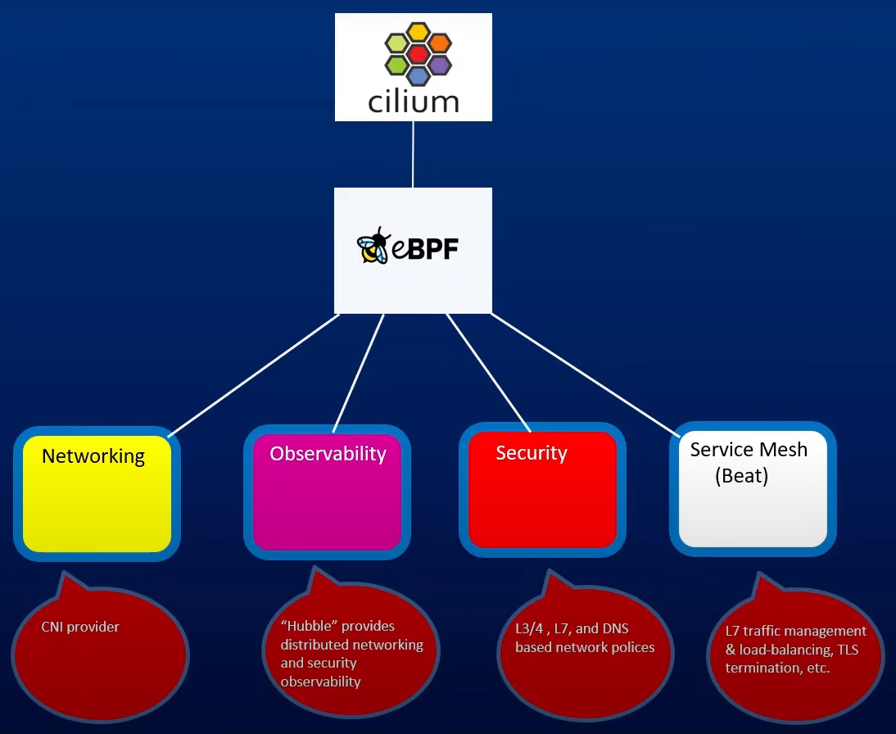
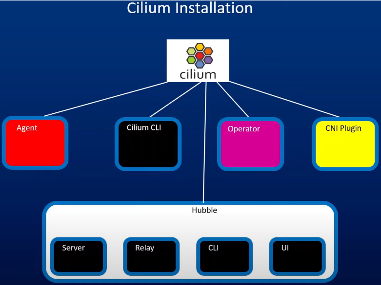

Cilium Kubernetes CNI Provider Deep Dive


<p align="center">
  
  <br/>
  Pic: container ID on worker node
</p>

What is Cilium?

eBPF overview
How Cilium leverages eBPF for load balancing
Cilium installation step by step

*Kube-proxy: This is a network proxy that runs on each node in the cluster. It is responsible for maintaining network rules on nodes. These network rules allow network communication to your Pods from network sessions inside or outside of your cluster. kube-proxy uses iptables or IPVS (IP Virtual Server) to manage networking rules and ensure efficient traffic routing within the cluster.*

**NAT Tables How IP Tables Works in Kubernetes **

`sudo iptables -t nat -n -L KUBE-SERVICES`

`sudo iptables -t nat -n -L KUBE-SVC-I24EZXP75AX5E7TU`


## iptables Kube-Proxy Mode Performance Issues for Large Kubernetes Installations

For each service add, multitude of iptables rules must be added.
Tables are not indexed. Sequential search is done to find which chains and rules applied to a packet.
Incremental changes are not supported (Copy all rules, make changes, save back)
It was never designed to be an efficient load balancer in extremely demanding situations.

## What is eBPF?
eBPF is a revolutionary technology with origins in the Linux kernel that can run sandboxed programs in a privileged context such as the operating system kernel. It is used to safely and efficiently extend the capabilities of the kernel without requiring to change kernel source code or load kernel modules.

Historically, the operating system has always been an ideal place to implement observability, security, and networking functionality due to the kernel’s privileged ability to oversee and control the entire system. At the same time, an operating system kernel is hard to evolve due to its central role and high requirement towards stability and security. The rate of innovation at the operating system level has thus traditionally been lower compared to functionality implemented outside of the operating system.


The Linux kernel supports a set of BPF hooks in the networking stack that can be used to run BPF programs. The Cilium datapath uses these hooks to load BPF programs that when used together create higher level networking constructs:
XDP: The XDP BPF hook is at the earliest point possible in the networking driver and triggers a run of the BPF program upon packet reception.
Traffic Control Ingress/Egress: BPF programs attached to the traffic control (tc) ingress hook are attached to a networking interface, same as XDP, but will run after the networking stack has done initial processing of the packet.
Socket operations: The socket operations hook is attached to a specific cgroup and runs on TCP events. Socket send/recv: The socket send/recv hook runs on every send operation performed by a TCP socket.

<p align="center">
  
  <br/>
  Pic: container ID on worker node
</p>


`kubectl expose deployment hello-world --port=8080 --target-port=8080 --type=ClusterIP`

Step 1: Locate Deployment
Deployment: A Deployment named hello-world exists in your Kubernetes cluster.
Kubernetes API Server: The kubectl command communicates with the API server to locate the hello-world deployment.
Step 2: API Server Creates Service
API Server: Once the deployment is located, the API server processes the request to create a Service.
Service Creation: The API server creates a Service object with the specified parameters (--port=8080, --target-port=8080, --type=ClusterIP).
Step 3: Assign ClusterIP & Create Endpoints
Service: The newly created Service gets assigned a ClusterIP (an internal IP within the cluster).
Endpoints: The Service selects the pods managed by the hello-world deployment using label selectors and creates endpoints for these pods.
Step 4: Update Networking Rules
kube-proxy: On each node in the cluster, kube-proxy updates the network rules.
Routing Traffic: These rules ensure that any traffic sent to the Service’s ClusterIP on port 8080 is routed to the target port 8080 on the selected pods.

[References](https://www.devopsschool.com/blog/kubernetes-workflow-from-kubectl-to-cri/)


**Note:** kube-proxy has another mode IPVS, IPVS not used IPTables.


## Cilium Installation


<p align="center">
  
  <br/>
  Pic: container ID on worker node
</p>


Agent: Runs on each node in the cluster and listens for events from orchestration systems such as Kubernetes to learn when containers or workloads are started and stopped. It also manages the eBPF programs which the Linux kernel uses to control all network access in / out of those containers.

The Cilium CLI is a command-line tool that is installed along with the Cilium agent. It interacts with the REST API of the Cilium agent running on the same node. The CLI allows inspecting the state and status of the local agent. It also provides tooling to directly access the eBPF maps to validate their state.

The Cilium Operator is responsible for managing duties in the cluster which should logically be handled once for the entire cluster, rather than once for each node in the cluster.

The Hubble server: runs on each node and retrieves the eBPF-based visibility from Cilium. It is embedded into the Cilium agent in order to achieve high performance and low- overhead. It offers a gRPC service to retrieve flows and Prometheus metrics.

Relay (hubble-relay) is a standalone component which is aware of all running Hubble servers and offers cluster-wide visibility by connecting to their respective gRPC APIs and providing an API that represents all servers in the cluster.


```yaml
helm install cilium cilium/cilium \
    --namespace kube-system \
    --set ipam.mode=kubernetes \
    --set kubeProxyReplacement=true \
    --set hubble.ui.enabled=true \
    --set hubble.relay.enabled=true \
    --set envoy.prometheus.enabled=true \
    --set k8sServiceHost=localhost \
    --set k8sServicePort=7445 \
    --set ipam.operator.clusterPoolIPv4PodCIDRList=192.168.170.0/16
```

## Install Cilium CLI [References](https://docs.cilium.io/en/latest/gettingstarted/k8s-install-default/)

