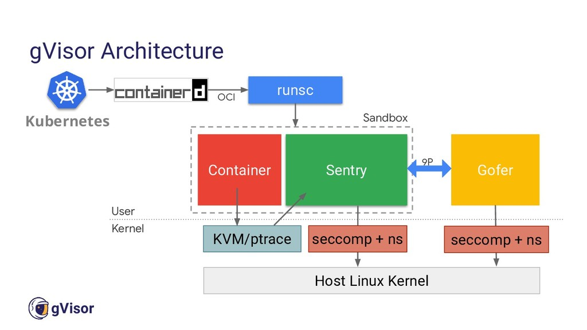

- [Container sandboxing?](#container-sandboxing)
- [gVisor](#gvisor)
- [Kata Containers](#kata-containers)
- [Runtime Classes](#runtime-classes)
- [CIS Benchmarks](#cis-benchmarks)
- [AppArmor](#apparmor)
- [Seccomp Profile](#seccomp-profile)
- [OPA (Open Policy Agent)](#opa-open-policy-agent)
- [KubeSec](#kubesec)
- [Trivy](#trivy)
- [Falco](#falco)

## Container sandboxing?
Container sandboxing enhances security by isolating containers using various techniques and tools such as namespaces, cgroups, seccomp, AppArmor, SELinux, and specialized runtimes like Kata Containers and gVisor. Implementing these mechanisms helps protect the host system and other containers, ensuring a more secure and stable containerized environment.

## gVisor
gVisor is an open-source container runtime that provides a secure and efficient way to sandbox containers by implementing a user-space kernel. It acts as a boundary between the application running inside the container and the host kernel, offering enhanced isolation and security.

  
   
  Pic: gVisor architecture

**Key Features of gVisor:**

- User-Space Kernel: Intercepts and handles system calls in user space, reducing the risk of kernel exploits.
- Compatibility: Works with Docker and Kubernetes, requiring minimal changes to existing workflows.
- Enhanced Security: Provides strong isolation by sandboxing containers, similar to virtual machines.
- Performance: Offers better performance than traditional VMs, though not as fast as native container runtimes.
- Ease of Integration: Easily integrates with container ecosystems, allowing seamless adoption.

**How gVisor Works:**
- Intercepting System Calls:
  - gVisor intercepts system calls from applications running in containers. Instead of passing these calls directly to the host kernel, it processes them in user space.

- Sentry and Gofer:
  - Sentry: The core user-space kernel that handles system calls, providing the necessary functionality to the containerized application.
  - Gofer: A component that interacts with the host filesystem and network, facilitating resource access for the container.

- Sandboxing:
  - gVisor runs containers in a sandbox, isolating them from the host system and other containers, thereby enhancing security.

[References](https://github.com/google/gvisor)

## Kata Containers
Kata Containers is an open-source project that aims to provide the security and isolation benefits of virtual machines (VMs) while maintaining the speed and efficiency of containers. It achieves this by running each container inside a lightweight VM, thereby combining the best features of both VMs and containers.

**It does this in two main ways:**
- In Kata, each container runs its own kernel instead of sharing the host system’s kernel with the host and other containers using cgroups. By extension, each container also gets its own I/O, memory access, and other low-level resources, without having to share them.
- In most cases, Kata containers can also take advantage of security features provided by hardware-level virtualization (meaning virtualization that is built into CPUs and made available using VT extensions).
  

  
   
  Pic: kata containers vs traditional vm containers

**Key Features of Kata container**

- Security: Runs in a dedicated kernel, providing isolation of network, I/O and memory and can utilize hardware-enforced isolation with virtualization VT extensions.
- Compatibility: Supports industry standards including OCI container format, Kubernetes CRI interface, as well as legacy virtualization technologies.
- Performance: Delivers consistent performance as standard Linux containers; increased isolation without the performance tax of standard virtual machines.
- Simplicity: Eliminates the requirement for nesting containers inside full blown virtual machines; standard interfaces make it easy to plug in and get started.
[References](https://katacontainers.io/#:~:text=Kata%20Containers%20is%20an%20open%20source%20community%20working%20to%20build,a%20second%20layer%20of%20defense.)

[Kata Containers Architecture](https://github.com/kata-containers/documentation/blob/master/design/architecture.md)

**How do Kata Containers work**

## Runtime Classes
RuntimeClass defines a class of container runtime supported in the cluster. The RuntimeClass is used to determine which container runtime is used to run all containers in a pod.\
RuntimeClasses are manually defined by a user or cluster provisioner, and referenced in the PodSpec. The Kubelet is responsible for resolving the RuntimeClassName reference before running the pod.

**Key Aspects of Runtime Classes**
- Customization:
  - Allows administrators to define different runtime configurations.
  - Enables selecting appropriate runtimes for various workloads, such as Kata Containers for enhanced security or other runtimes for performance optimization.

- Isolation and Security:
  - Facilitates running certain workloads with enhanced isolation using runtimes like Kata Containers.
  - Ensures that security-sensitive applications can benefit from stronger isolation without affecting the entire cluster.

- Performance:
  - Optimizes resource utilization by allowing the use of different runtimes tailored to specific performance requirements.

**How Runtime Classes Work**

- Define Runtime Classes:
  - Administrators create RuntimeClass objects in Kubernetes, specifying the desired container runtime and configuration.

- Assign Runtime Classes:
  - Workloads (Pods) can specify which RuntimeClass to use through their Pod specification.

- Scheduler and Kubelet:
  - The Kubernetes scheduler and Kubelet handle the scheduling and execution of Pods according to their specified RuntimeClass, ensuring the correct runtime is used.

## CIS Benchmarks
These are best practices and security configuration guidelines developed by the Center for Internet Security (CIS) to help organizations secure their systems and software. CIS Benchmarks provide detailed recommendations for securing various platforms, including operating systems, databases, and cloud services, by outlining security controls and configurations.

## AppArmor
AppArmor is a Linux kernel security module that provides Mandatory Access Control (MAC) protection. It allows you to define security profiles for applications, specifying what system resources they can access and what operations they can perform. In Kubernetes, AppArmor profiles can be used to enforce security policies for containers, restricting their capabilities and reducing the attack surface.

## Seccomp Profile
Seccomp, short for Secure Computing Mode, is a Linux kernel feature that restricts the system calls a process can make. Seccomp profiles define a whitelist or blacklist of allowed or denied system calls for a process, enhancing security by limiting the actions a containerized application can perform. In Kubernetes, seccomp profiles can be used to enforce tighter restrictions on container behavior, reducing the risk of exploitation.

## OPA (Open Policy Agent)
OPA is an open-source policy engine that provides fine-grained, declarative policy enforcement for cloud-native environments. It allows you to define and enforce policies across the entire stack, from infrastructure to applications. OPA enables policy as code, making it easier to manage and automate policy enforcement in Kubernetes and other cloud-native platforms.

## KubeSec
KubeSec is a tool or framework used for Kubernetes security assessment and best practices enforcement. It helps organizations identify and remediate security risks in their Kubernetes clusters by analyzing configurations, scanning for vulnerabilities, and enforcing security policies.

## Trivy
Trivy is an open-source vulnerability scanner for containers and other artifacts, such as operating system packages and application dependencies. It helps organizations identify security vulnerabilities in their container images and provides actionable insights to remediate them. Trivy integrates with CI/CD pipelines and container registries to automate vulnerability scanning in Kubernetes environments.

## Falco
Falco is an open-source cloud-native runtime security tool that detects abnormal behavior and security threats in Kubernetes environments. It monitors system calls and container activities in real-time, alerting administrators to suspicious activities that may indicate a security breach or policy violation. Falco helps organizations improve their Kubernetes security posture by providing runtime threat detection and response capabilities.

Container Run
docker run -d nginx
Docker CLI
REST API
Docker Daemon
Images Volumes Networks
containerd
Manage Containers
containerd-shim
runC
Run containers
Namespace CGroup