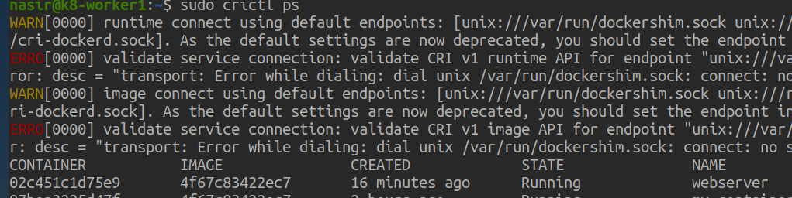
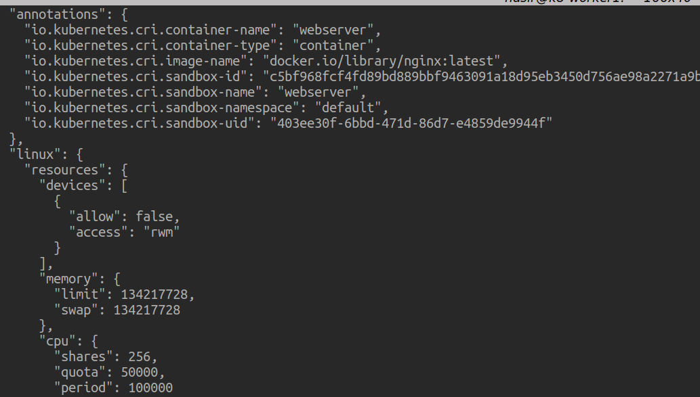
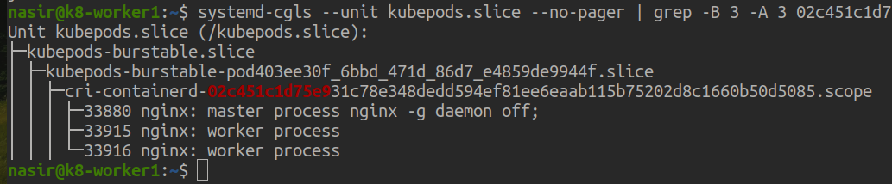
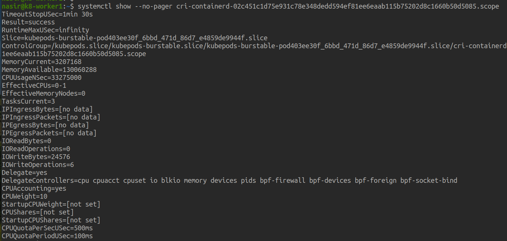

## What are Cgroups?
Control Groups, or cgroups for short, are a Linux kernel feature that takes care of resource allocation (CPU time, memory, network bandwidth, I/O), prioritization and accounting (how much is container using?). Additionally, besides being a Linux primitive, cgroups are also a building block of containers, so without cgroups there would be no containers.

As the name implies - the cgroups are groups, so they group processes in parent-child hierarchy, which forms a tree. So, if - for example - parent cgroup is assigned 128Mi of RAM, then sum of RAM usage of all of its children cannot exceed 128Mi.

This hierarchy lives in /sys/fs/cgroup/, which is the cgroup filesystem (cgroupfs). There you will find sub-trees for all Linux processes. Here we're interested in how cgroups impact scheduling and resources assigned/allocated to our Kubernetes Pods, so the part we care about is `kubepods.slice/`:


## Why are cgroups needed ?
**Resource Allocation:** Cgroups allocate system resources like CPU, memory, and I/O bandwidth fairly among processes or containers, preventing resource monopolization.

**Resource Isolation:** Cgroups isolate processes or containers from each other, ensuring that one doesn't affect the performance of others.

**Performance Management:** Cgroups enable administrators to manage system performance by setting resource limits and priorities at the group level.

**Accounting and Monitoring:** Cgroups track resource usage, aiding in capacity planning, performance tuning, and issue troubleshooting.

**Multi-Tenancy Support:** Cgroups facilitate multi-tenancy by enforcing resource limits and isolation between users or tenants in shared environments.

**Containerization:** Cgroups are fundamental to container technologies, providing the necessary mechanisms for resource control and isolation essential for container operation.


## How are cgroups implemented ?

Cgroups, or Control Groups, are implemented in the Linux kernel through kernel-level features and data structures. They organize processes into hierarchical groups, providing resource management and isolation capabilities. Here's how they are implemented:

**Kernel Modules:** Cgroups are implemented as part of the Linux kernel, with specific kernel modules responsible for their functionality. These modules extend the kernel's capabilities to manage resources like CPU, memory, and I/O.

**Filesystem Representation:** Cgroups are represented as directories in the filesystem, typically located under /sys/fs/cgroup/. Each cgroup directory contains control files that allow administrators to configure resource limits and other parameters.

**Hierarchical Structure:** Cgroups organize processes into a hierarchical structure, forming a tree-like arrangement. Each cgroup represents a group of processes or tasks, with parent-child relationships defining inheritance of resource limits and other properties.

**Subsystem Controllers:** Cgroups support multiple subsystem controllers, each responsible for managing specific resources or behaviors. For example, the CPU controller manages CPU resource allocation, while the memory controller manages memory usage.

**Resource Limitation:** Cgroups enforce resource limits by tracking and controlling resource usage within each cgroup. This involves mechanisms like kernel-level accounting and throttling to ensure that processes adhere to specified resource constraints.

**Task Assignment:** Processes are assigned to cgroups based on certain criteria, such as the process owner or attributes. Once assigned, processes inherit the resource limits and properties defined for their respective cgroups.

**Kernel Interface:** Cgroups provide a kernel interface that allows user-space tools and utilities to interact with cgroup control files and manage cgroup behavior. This interface enables administrators to configure resource limits, monitor usage, and control cgroup behavior.

In summary, cgroups are implemented as part of the Linux kernel, providing a framework for organizing processes into groups and managing system resources effectively. They play a crucial role in resource allocation, isolation, and performance management in modern computing environments.


## Let's find out how does it works?
Let's now walk through all the steps to better understand how the Pod requests and limits get translated/propagated all the way to files in `/sys/fs/cgroup/`

We begin with simple Pod definition that includes memory and CPU requests/limits

```yaml
apiVersion: v1
kind: Pod
metadata:
  labels:
    run: webserver
  name: webserver
spec:
  containers:
  - image: nginx
    name: webserver
    resources:
      requests:
        memory: "64Mi"
        cpu: "250m"
      limits:
        memory: "128Mi"
        cpu: "500m"
```
When we create/apply this Pod manifest, the Pod gets assigned to a Node and the kubelet on the Node takes this PodSpec and passes it to Container Runtime Interface (CRI), e.g. containerd or CRI-O, which translates it to lower level OCI JSON spec that describes the container that will be created:

`sudo crictl ps`

<p align="center">
  
  <br/>
  Pic: container ID on worker node
</p>

This command will provide the JSON representation of the container's metadata and runtime information.

`sudo crictl inspect 02c451c1d75e9`

<p align="center">
  
  <br/>
  Pic: POD JSON Details
</p>

Display the control group (cgroup) hierarchy managed by systemd for the unit named kubepods.slice.

`systemd-cgls --unit kubepods.slice --no-pager`

`systemd-cgls --unit kubepods.slice --no-pager | grep -B 2 -A 2 podid`

`systemd-cgls --unit kubepods.slice --no-pager | grep -B 3 -A 3 02c451c1d75e9`

<p align="center">
  
  <br/>
  Pic:  cGriup Hierarcy
</p>

Display detailed information about a specific systemd scope unit named 

`systemctl show --no-pager cri-containerd-02c451c1d75e931c78e348dedd594ef81ee6eaab115b75202d8c1660b50d5085.scope`

<p align="center">
  
  <br/>
  Pic:  Detailed information about a specific systemd scope of a Container
</p>
The resource limit information for CPU and memory is present in the output you provided. Here's where you can find it:

**CPU resource limit information:**

- `CPUAccounting=yes`: Indicates that CPU accounting is enabled.
- `CPUWeight=10`: Specifies the CPU weight.
- `CPUQuotaPerSecUSec=500ms`: Specifies the CPU quota per second.
- `CPUQuotaPeriodUSec=100ms`: Specifies the CPU quota period.

**Memory resource limit information:**

- `MemoryAccounting=yes`: Indicates that memory accounting is enabled.
- `MemoryHigh=infinity`: Specifies the upper limit for memory usage.
- `MemoryMax=134217728`: Specifies the maximum amount of memory.
- `MemoryLimit=infinity`: Specifies the memory limit.


These files and directories provide various parameters and metrics for managing and monitoring the resources allocated to the processes within the cgroup associated with this pod.

`/sys/fs/cgroup/kubepods.slice/kubepods-burstable.slice`

`ls -la kubepods-burstable-pod403ee30f_6bbd_471d_86d7_e4859de9944f.slice`

